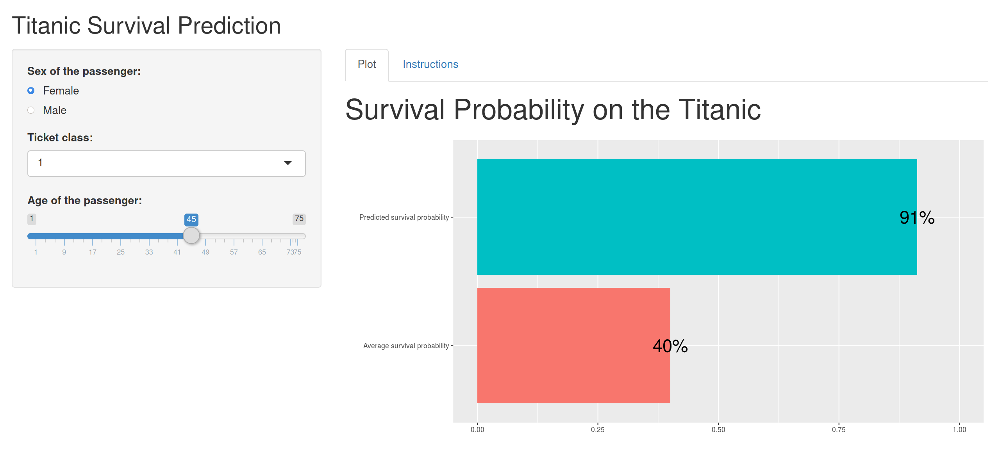

```{r setup, include=FALSE}
knitr::opts_chunk$set(echo=FALSE, message=FALSE, warning=FALSE, comment="")
```

## Description

### Target and Objective

- build an interactive **Shiny** app
- learn how to handle UI-server requests in `R`
- show a result to the public by sharing a tool

### Methodology

- consider the **Titanic dataset**
- simplify the input for the end-user
- give predictions on survival probability (**logistic regression**)

## Web App

### What

- the web app outputs the survival probability of hypothetical passengers
- compare the **hypothetical** with **average real** outcome

### Where

- the app is hosted on [shinyapps.io](https://thesfinox.shinyapps.io/TitanicSurvival/)
- the code is hosted on [github.com](https://github.com/thesfinox/titanic-coursera)

### Why

- it is indeed a good exercise to practice `R`, machine learning and data analysis
- why not?

## Sample input

This is an example of possible inputs:
```{r}
library(titanic)
library(knitr)
library(dplyr)
train <- titanic_train
train <- train[,c(2,3,5,6)]
train$Survived <- as.factor(train$Survived)
train$Pclass <- as.factor(train$Pclass)
train$Sex <- as.factor(train$Sex)
train$Age <- as.numeric(train$Age)
train <- train %>% filter(Age >= 1)
train$Age <- as.integer(train$Age)

kable(head(train, 3))
```

- they are handled by the UI in the web app
- N.B.: **instructions** are on the app website

## Sample output

- a taste of the output



- **cool, isn't it?**